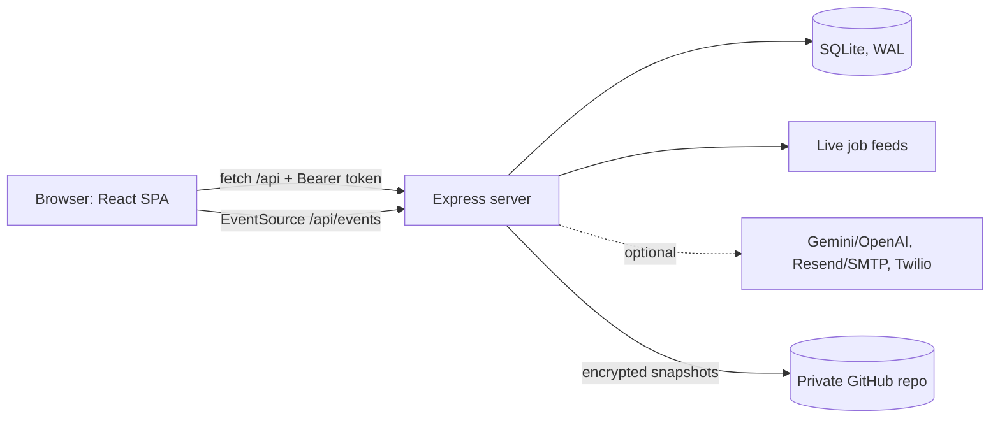

# CareerReady: Project Overview

> Everything in this document was checked against the actual source code (versions come from `package-lock.json`, counts from the code and database schema).

## 1. Pin-ready summary

> Full-stack career-readiness platform for engineering students: skill assessments, personalised roadmaps, job and internship tracking, resume analysis, verified mentors with booking, and a peer community. React + Express + SQLite.

**Suggested GitHub topics:**
`react` `vite` `nodejs` `express` `sqlite` `better-sqlite3` `career` `mentorship` `student-platform` `server-sent-events` `docker` `render` `github-actions`

**Live site:** https://carrerready.onrender.com
**Repo:** https://github.com/mollachandhana-cpu/CarrerReady

CareerReady helps engineering students (CSE, ECE, EEE, Mechanical, Civil) find out where they stand and what to do next. A student takes a skills assessment, picks a target role, gets a step-by-step roadmap and a readiness score, tracks applications, matches live jobs, and books sessions with admin-verified mentors. Three roles (student, mentor, admin) share one app with live updates.

---

## 2. Features

### Students
- **Skills assessment:** 12 questions across Programming, Aptitude and Communication, with a per-category score.
- **Readiness score and coach:** a rule-based dashboard that turns assessment results into recommendations and a priority action plan.
- **Career paths:** 9 seeded roles (Frontend, Backend, Data Analyst, Cloud/DevOps, Embedded, VLSI, Power Systems, Mechanical Design, Civil/Site) with 45 roadmap steps. Each role has a *fit* score from weighted assessment results plus a branch bonus, and skill-gap detection.
- **Live jobs:** pulled from public job feeds (Arbeitnow and Remotive) every 10 minutes, matched to the chosen role by keywords.
- **Internships:** curated listings (10 seeded) that can be saved, with an application tracker.
- **Application tracker:** statuses *Interested → Applied → Interview → Offer / Rejected / Withdrawn*.
- **Resume intelligence:** keyword-based score against the target role, with missing-skill gaps. Optional AI review.
- **Mock interview prep:** question bank by category, with optional AI feedback.
- **Profile page** (skills, interests, links, bio) and an insights dashboard (application funnel, saved items, latest scores, roadmap progress).
- **Peer community:** discussions, replies, likes, search, and reporting.

### Mentors
- Apply through an **invite code** (optionally locked to an email), then wait for **admin verification**. The mentor role is only granted when the profile is approved.
- Publish **availability slots**, accept connection requests, run **sessions** with an auto-generated Jitsi meeting link, assign **tasks**, write **evaluations**, share **resources**, and receive **ratings and reviews**.
- Optional AI-generated *student brief* before a session.

### Admins
- Review mentor applications, create invite codes, suspend or reactivate accounts, remove reported posts, see platform overview counts, download a database backup, and view an **audit log** of sensitive actions.

---

## 3. Technology stack (exact resolved versions)

| Layer | Technology | Version |
|---|---|---|
| Runtime | Node.js | ≥ 20 (`engines`), Render pins 20.18.0 |
| Frontend framework | React + React DOM | 18.3.1 |
| Build tool | Vite | 5.4.21 |
| Vite React plugin | @vitejs/plugin-react | 4.7.0 |
| Frontend styling | Hand-written CSS with CSS variables (`App.css`, `index.css`), no UI library | — |
| Frontend HTTP | Native `fetch` through a small `api.js` wrapper | — |
| Backend framework | Express | 4.22.3 |
| CORS | cors | 2.8.6 |
| Database | SQLite via better-sqlite3 (WAL mode) | 12.11.1 |
| Email | Resend HTTPS API, or SMTP via nodemailer | 6.10.1 |
| Dev tooling | concurrently | 9.2.4 |
| Containers | Docker (`node:20-bookworm-slim`) | — |
| Hosting | Render (Node web service) | — |
| CI/CD | GitHub Actions | `actions/checkout@v4`, `setup-node@v4` |
| Security scanning | GitHub CodeQL (push, PR, weekly) | — |

**Optional external services (all off unless configured):** Google Gemini (default model `gemini-2.5-flash`) or OpenAI for AI features, Twilio for SMS, Resend or SMTP for email, Jitsi Meet for video links.

**Notable choices:** no ORM (plain SQL prepared statements), no auth library (hand-built sessions with Node's `crypto`), no CSS framework, no websocket library (Server-Sent Events).

**Size:** about 4,800 lines across 10 server files and 9 frontend files, with 28 database tables and 75 API endpoints.

---

## 4. Architecture



- **Single deployable:** Express serves the built React app (`dist/`) and the JSON API from one process, so there is no CORS setup and one URL.
- **Static caching:** hashed `/assets/*` are served as immutable for a year; `index.html` is `no-cache`.
- **Dev mode:** Vite on port 5173 proxies `/api` to Express on 6000 (`npm run dev:full` runs both).

### Backend modules (`server/`)

| File | Responsibility |
|---|---|
| `server.cjs` | App setup, auth middleware, signup/login, readiness engine, roles and roadmaps, live-job fetcher, SSE, graceful shutdown |
| `database.cjs` | Opens SQLite, creates core tables, seeds questions, internships, roles and roadmaps |
| `launch.cjs` | Security headers, rate limiting, email verification, password reset, mentor invites and verification, slots and booking, reviews, admin panel, nightly backup, admin bootstrap |
| `extras.cjs` | Insights, application tracker, profile, interview prep, coach |
| `production-integrations.cjs` | Mentor workflow (connections, tasks, evaluations, resources), community routes, profile updates |
| `ai.cjs` | Gemini/OpenAI client with friendly error messages |
| `remote-backup.cjs`, `restore-db.cjs` | Free-tier persistence (see section 8) |
| `env.cjs` | Tiny `.env` loader (real environment variables always win) |
| `promote-admin.cjs` | CLI to promote an account to admin |

Modules are registered in order so the safer routes in `launch.cjs` take priority over older ones.

### Frontend (`src/`)

`main.jsx` → `App.jsx` (shell, tabs, dashboard, career paths, assessment, live jobs, internships, resume, application tracker, interview prep, coach, profile) · `MentorHub.jsx` (student, mentor and admin views, booking, reviews) · `Community.jsx` · `Login.jsx` / `Signup.jsx` · `api.js` (fetch wrapper, token in `localStorage` under `careerready_token`). State is local React hooks (`useState`, `useEffect`, `useCallback`), with no state-management library.

---

## 5. Database

SQLite file `careerready.db`, `journal_mode=WAL`, `busy_timeout=5000`, `synchronous=NORMAL`. Schema upgrades are additive and safe to re-run (`CREATE TABLE IF NOT EXISTS`, `addColumn()` helper), so existing data survives upgrades.

**28 tables:**
- **Accounts:** `users`, `sessions`, `email_tokens`, `audit_log`
- **Learning:** `questions`, `assessments`, `roles`, `roadmap_steps`, `user_goals`, `user_progress`
- **Jobs:** `internships`, `saved`, `applications`, `live_jobs`, `resumes`
- **Mentorship:** `mentor_profiles`, `mentor_invites`, `mentor_connections`, `mentor_slots`, `mentor_sessions`, `session_reviews`, `mentor_tasks`, `mentor_evaluations`, `mentor_resources`
- **Community:** `community_posts`, `community_replies`, `community_likes`, `community_reports`

---

## 6. Security model

- **Passwords:** salted `scrypt` (64-byte key), compared with `timingSafeEqual`. Async variant used so hashing never blocks other requests.
- **Sessions:** random 24-byte tokens, **stored only as SHA-256 hashes**, so a leaked database file cannot be used to log in. 30-day expiry, expired sessions cleaned daily. This is an opaque-token design, not JWT.
- **Roles:** `student`, `mentor`, `admin`. Admins cannot be changed or become mentors, and the mentor role needs admin approval. There is no admin option on signup. Admin is granted through the `ADMIN_EMAIL` setting or `npm run promote-admin`.
- **Admin bootstrap:** the account matching `ADMIN_EMAIL` is promoted at boot, and again on its first authenticated request, but only if the session is valid, active and email-verified.
- **Rate limits:** login (10 per 15 min per IP and email), signup, password reset, verification resend, AI calls, community posts and replies, mentor connects, backups.
- **HTTP hardening:** CSP, `X-Frame-Options: DENY`, `nosniff`, `Referrer-Policy`, `Permissions-Policy`, HSTS in production, 200 KB JSON body limit, `trust proxy` behind Render.
- **Suspended accounts** are blocked at login and at every authenticated request.
- **Audit log** for sensitive admin actions.

---

## 7. Real-time updates

An authenticated **Server-Sent Events** stream (`/api/events`, 25-second heartbeat) pushes events such as `sync`, `mentor-session`, `application`, `saved`, `profile`, `progress`, `online`, and mentor task updates, so dashboards update across tabs and devices without polling or a websocket library.

---

## 8. Deployment, DevOps and data persistence

- **Hosting:** Render web service (`render.yaml`, build `npm ci && npm run build`, start `npm start`, health check `/api/health`).
- **Docker:** image installs a compiler toolchain for `better-sqlite3`, builds the frontend, and runs `npm start`.
- **CI:** GitHub Actions runs `npm ci`, `npm run check` (syntax-checks every server file) and `npm run build` on pushes and PRs. CodeQL scans weekly.
- **Backups:** nightly local snapshots (newest 7 kept) and an admin-only download endpoint.
- **Free-tier persistence:** Render Free has no persistent disk, so the database used to reset on every restart. The app now keeps an **AES-256-GCM encrypted, gzip-compressed** copy of the database in a private GitHub repo, restores it before the server starts, saves it again after changes (at most every 10 minutes) and on shutdown, and refuses to upload after a failed restore so a good snapshot is never overwritten with an empty one. With a paid disk (`DATA_DIR=/var/data`), the local database is used and nothing is overwritten.
- **Graceful shutdown:** on `SIGTERM` the server stops accepting traffic, flushes the backup, and checkpoints SQLite.

**Environment variables:** `NODE_ENV`, `PORT`, `HOST`, `APP_URL`, `DATA_DIR`, `ADMIN_EMAIL`, `RESEND_API_KEY` or `SMTP_*`, `MAIL_FROM`, `GEMINI_API_KEY` / `GEMINI_MODEL`, `OPENAI_API_KEY` / `OPENAI_MODEL`, `TWILIO_*`, `BACKUP_GITHUB_REPO`, `BACKUP_GITHUB_TOKEN`, `BACKUP_KEY`.

---

## 9. Run it locally

```bash
npm install
cp .env.example .env            # fill in only what you need
npm run dev:full                # API on :6000, web on :5173
npm run check                   # syntax-check the server
npm run build && npm start      # production-style run
npm run promote-admin -- you@example.com
```

---

## 10. Engineering challenges solved (good interview material)

1. **Admin promotion that depended on boot timing.** The promotion ran once at startup, before the account existed in a fresh database. Fixed deterministically (no `setTimeout`) by also promoting on the account's first valid, verified, active session, with tests covering other users, expired tokens, unverified and suspended accounts.
2. **Persistence on a platform with no free disk.** Designed encrypted snapshot and restore with a safety guard against overwriting good data, retry and conflict handling for overlapping deploys, and a shutdown flush. Tested against a mock of the GitHub API.
3. **Event-loop safety.** Switched password hashing to async `scrypt` so logins don't stall live streams.
4. **Safe schema evolution** so production data survives feature releases.

---

## 11. Known limitations (be honest about these)

- **Email, SMS and AI are currently switched off in production** (logs show `email=off sms=off ai=off`). Verification and reset emails can't be sent until a provider is configured, and until then new accounts are treated as verified.
- **SQLite means one server instance.** Scaling out would need a client/server database.
- **Free-tier persistence is best effort:** up to about 10 minutes of recent changes can be lost on a hard crash, and each cold start takes a few extra seconds.
- **Readiness scoring, resume scoring and the coach are rule-based**, not machine learning. The AI features are optional calls to Gemini or OpenAI.
- **Small seed content:** 12 assessment questions and 10 internships.
- **No automated test suite yet.** CI checks syntax and the build only.

---

## 12. Resume and LinkedIn bullets

- Built **CareerReady**, a full-stack career platform (React 18, Vite, Express, SQLite) with three roles, 28 tables and 75 REST endpoints, deployed on Render with Docker and GitHub Actions CI plus CodeQL.
- Implemented hand-rolled auth: salted scrypt password hashing, hashed opaque session tokens, role-based access control, per-route rate limiting, CSP and HSTS headers, and an audit log.
- Added live updates with Server-Sent Events and a mentor marketplace covering invite-based onboarding, admin verification, availability slots, booking with video links, reviews and ratings.
- Designed an encrypted snapshot-and-restore system that gives a free-tier host durable storage, with failure guards to prevent data loss, verified by an automated test harness.
